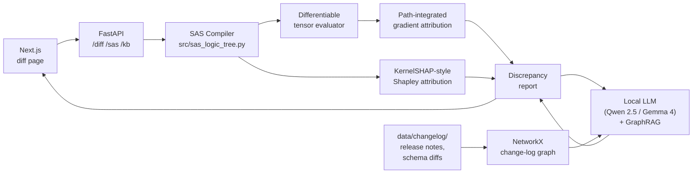

# RegLLM

Two related applications for IRB / IFRS 9 regulatory data pipelines:

1. **DQC Generator** (`DQC/`, `api/routers/dqc.py`) — generates structured
   data-quality checks (SQL) for a database whose schema and dictionary are
   known, grounded in the EBA GL/2017/16 PD & LGD guidelines via a regulation
   knowledge graph. Ships with an Angular chat UI, an AWS (ECS Fargate +
   Bedrock) deployment, and a mutation-testing **eval harness**
   (`DQC/eval/`) that scores generated checks against 48 ground-truth
   defects across 8 data-quality dimensions. See
   [`DQC/eval/README.md`](DQC/eval/README.md) and
   [`docs/EVALUATION.md`](docs/EVALUATION.md).
2. **SAS Field-Diff Explainer** — *why is the value of this field different
   in V3 versus V2 of the same table?* — answered with a differentiable AST,
   Shapley values, and a change-log GraphRAG grounded by a local LLM.
   Documented in the rest of this README.

The FastAPI backend serves both: the router set is selected with
`REGLLM_ROUTERS` (`all` by default; the AWS DQC deployment sets
`REGLLM_ROUTERS=dqc` for a slim surface).

---

## What it does

Given:

- a SAS pipeline (e.g. an IRB / IFRS 9 calibration script),
- two snapshots of the same row in two table versions (`V2` and `V3`),
- a chosen target field (`Y`, e.g. `ECL`),

RegLLM tells you **why `Y` differs between V2 and V3**, by combining:

1. **Path-integrated gradients** (Aumann–Shapley) — built on a
   differentiable evaluator of the SAS AST that uses
   `torch.tensor(..., requires_grad=True)` for every numeric input.
2. **Shapley values** (exact for ≤ 12 differing fields, permutation
   sampling otherwise) — handles categorical / non-smooth fields and
   branch flips, using the eager Python evaluator as a black box.
3. **V2-vs-V3 code diff** — the SAS pipeline itself can change between
   versions. The UI compares the two scripts AST-to-AST, scopes the diff
   to the target field's lineage, and decomposes the total Δ into a
   *data Δ* and a *code Δ* component:

   ```
   ΔY_total ≈  Y(row_v3, code_v3) − Y(row_v2, code_v2)
              = [Y(row_v3, code_v3) − Y(row_v2, code_v3)]    ← data Δ
              + [Y(row_v2, code_v3) − Y(row_v2, code_v2)]    ← code Δ
   ```

4. **GraphRAG over the database change-log** — every documented field
   change becomes a graph node; for each suspect field we retrieve the
   relevant subgraph and ask the local LLM whether the delta is
   *justified by a documented release note*.

Both attribution methods satisfy the *efficiency axiom*
(`Σᵢ φᵢ ≈ Y(V3) − Y(V2)`), and any residual is reported explicitly,
along with branch flips that may make the gradient locally undefined.

---

## Architecture



### Repository layout

| Path                                | Role                                              |
|-------------------------------------|---------------------------------------------------|
| `src/sas_parser.py`                 | `.sas` / `.egp` → code blocks                     |
| `src/sas_logic_tree.py`             | AST + lineage walker + reference Python evaluator |
| `src/sas_diff/tensor_evaluator.py`  | Torch-based differentiable AST evaluator          |
| `src/sas_diff/gradient_explainer.py`| Path-integrated (Aumann–Shapley) attribution      |
| `src/sas_diff/shapley_explainer.py` | KernelSHAP-style Shapley attribution              |
| `src/sas_diff/discrepancy.py`       | High-level `explain_field_diff` orchestrator      |
| `src/knowledge/llm_client.py`       | LiteRT-LM / Ollama OpenAI-compatible client       |
| `src/knowledge/change_log_graph.py` | Markdown + DDL → NetworkX graph                   |
| `src/knowledge/graph_rag.py`        | Subgraph retrieval + LLM-grounded justification   |
| `frontend/components/diff/LineageGraph.tsx` | Force-directed lineage graph (Obsidian-style)    |
| `frontend/components/diff/AskAgent.tsx`     | Agentic Q&A panel (SSE trace + final answer)     |
| `src/agent/`                        | Tool registry + tool-calling agent loop           |
| `src/agent/tools.py`                | 8 tools the LLM can call (lineage, attribution …)|
| `src/agent/code_diff.py`            | V2-vs-V3 SAS comparator scoped to a target field  |
| `src/agent/docs_index.py`           | BM25 index over `data/docs/**/*.md`               |
| `api/main.py`                       | FastAPI entry point                               |
| `api/routers/{sas,diff,kb,agent}.py`| REST endpoints                                    |
| `frontend/app/diff/page.tsx`        | Single-page diff UI (Manual / Ask tabs)           |
| `data/samples/`                     | Bundled `sample_lgd.sas`, `cycles_v[23].csv`      |
| `data/sas/{v2,v3}/`                 | User-supplied SAS scripts compared by the agent   |
| `data/docs/**/*.md`                 | Markdown corpus indexed for the agent (BM25)      |
| `data/changelog/`                   | Markdown change notes + persisted graph           |
| `demo/sas_compiler_demo.py`         | CLI: AST, lineage, simulation, **`--diff`**       |
| `scripts/seed_docs.py`              | Bootstrap V2/V3 SAS + docs corpus                 |
| `tests/`                            | Pytest suite (~600 tests, ~40 s)                  |
| `DQC/app/`                          | Angular chat UI for the DQC generator             |
| `DQC/eval/`                         | DQC eval harness (defect catalog + trap DBs)      |
| `DQC/cdk/`, `DQC/terraform/`        | AWS infra (ECS Fargate + ALB + Bedrock IAM)       |
| `api/routers/dqc.py`                | DQC generation + validation endpoints             |
| `training/dq/`                      | GRPO/RL pipeline for the DQC model                |
| `Dockerfile`                        | API container build                               |
| `frontend/Dockerfile`               | Next.js standalone container build                |
| `docker/api-entrypoint.sh`          | Auto-seed data + index on first run               |
| `docker-compose.yml`                | Full stack: ollama + api + web                    |
| `docker-compose.host-ollama.yml`    | Override that uses a host-installed Ollama        |
| `start.ps1` / `start.bat`           | Windows one-command launchers                     |
| `stop.ps1`  / `stop.bat`            | Windows stop / purge scripts                      |
| `.env.example`                      | Environment template (model tag + ports)          |

---

## One-shot quickstart (Docker)

The whole stack — Ollama with the model, FastAPI backend, and Next.js
frontend — runs from a single command. Works identically on **Windows**,
**macOS** and **Linux**.

### Prerequisites

- [Docker Desktop](https://www.docker.com/products/docker-desktop/) on
  Windows / macOS, or Docker Engine + Compose on Linux.
- ~12 GB free disk for the default 14 B Qwen model (smaller variants
  configurable in `.env` — see below).
- ~16 GB RAM recommended (8 GB works with the 7 B model).
- First boot is slow because Ollama pulls ~9 GB. Subsequent boots are
  fast.

### Windows

```powershell
# PowerShell (recommended)
.\start.ps1
```

```cmd
:: …or cmd.exe
start.bat
```

The PowerShell launcher takes optional flags:

```powershell
.\start.ps1 -Model qwen2.5:7b-instruct-q4_K_M   # smaller model
.\start.ps1 -Rebuild                             # force --no-cache build
.\start.ps1 -NoBrowser                           # don't auto-open the UI
.\stop.ps1                                       # stop containers
.\stop.ps1 -Purge                                # also drop the ~9 GB model cache
```

### macOS / Linux

```bash
docker compose up --build
```

…or just open `http://localhost:3010/diff` after running:

```bash
cp .env.example .env
docker compose up -d --build
```

### What gets started

| Service       | Port    | Image                          | Purpose                               |
|---------------|--------:|--------------------------------|---------------------------------------|
| `ollama`      | `11434` | `ollama/ollama:latest`         | Local LLM server                      |
| `ollama-init` | —       | `ollama/ollama:latest`         | Pulls the model on first run, exits   |
| `api`         | `8000`  | `regllm-api`     (this repo)   | FastAPI: `/sas`, `/diff`, `/kb`, `/agent` |
| `web`         | `3010`  | `regllm-web`     (this repo)   | Next.js standalone UI                 |

Healthchecks are wired between them: `web` only starts once `api` is
healthy, which only starts once `ollama-init` succeeds. The first
`docker compose up` therefore blocks on the model download — the
PowerShell / batch launchers tail those logs for you so the progress is
visible.

`./data` is bind-mounted into the API container, so anything you drop
into `data/sas/v3/*.sas`, `data/docs/**/*.md` or `data/changelog/*.md`
on the host shows up immediately inside the running stack — no rebuild
needed. Reindex on demand:

```bash
curl -X POST http://localhost:8000/agent/docs/reindex
curl -X POST http://localhost:8000/kb/reindex
```

### Configuration

Copy `.env.example` to `.env` to customise:

```env
OLLAMA_MODEL=qwen2.5:14b-instruct-q4_K_M    # default
# OLLAMA_MODEL=qwen2.5:7b-instruct-q4_K_M   # ~4.7 GB, 8 GB RAM
# OLLAMA_MODEL=qwen2.5:3b-instruct-q4_K_M   # ~2 GB,   4 GB RAM
API_PORT=8000
WEB_PORT=3010
OLLAMA_PORT=11434
```

### Using a host-installed Ollama

If you already run Ollama natively (e.g. for GPU inference on Windows
with NVIDIA Container Toolkit, or a separate Ollama server elsewhere on
your network), use the included override to skip the dockerised one:

```bash
docker compose -f docker-compose.yml -f docker-compose.host-ollama.yml up -d
```

On Linux, set `OLLAMA_HOST=0.0.0.0:11434` before `ollama serve` so the
container can reach it.

### Updating

```bash
git pull
docker compose build --pull
docker compose up -d
```

### What the demo UI shows

Open `http://localhost:3010/diff` and try `CIC_00076` (a CORP cycle). On
this row, V2 ECL = 66.10 and V3 ECL = 110.18, but the only V3 input
field that differs from V2 is… none of them. The whole +44.07 swing comes
from a code change. The UI surfaces the entire story:

- **SAS pipeline panel** — three tabs:
  - **V3 code** — the active pipeline; drives the lineage graph and the
    autograd attribution.
  - **V2 code** — editable; flagged with an amber "V2 ≠ V3 code" badge
    when it differs.
  - **Diff** — target-scoped, AST-aware diff. Each modified data step
    expands into a side-by-side V2/V3 code panel.
- **Lineage graph** (top-right) — every field that's read or written by a
  step that changed between V2 and V3 is ringed in fuchsia. The legend
  shows the colour map.
- **Δ ECL = data Δ + code Δ bar** — a stacked bar that splits the
  observed delta into a sky-blue *data* component and a fuchsia *code*
  component, with the underlying `Y(row_*, code_*)` anchor values
  printed below for full transparency.
- **Code changes affecting ECL panel** — a list of the SAS data steps
  that produce or read fields on the target's lineage and that differ
  between V2 and V3, each expandable into a V2/V3 code diff.
- **GraphRAG verdict** — the local LLM's per-field justified/unjustified
  call, with citation snippets pulled from `data/changelog/*.md`.
- **Ask tab** — natural-language Q&A. Type *"Why does CIC_00076 have a
  different ECL in V3 versus V2?"* and Qwen autonomously calls the
  attribution + code-diff + docs-search tools and writes a Markdown
  answer with citations and graph highlights.

---

## Manual quickstart (without Docker)

### 1. Install

```bash
python -m venv .venv && source .venv/bin/activate
pip install -r requirements.txt
```

`torch` is the heaviest dependency. The CPU build is sufficient.

### 2. Generate the V2/V3 sample tables

```bash
python scripts/generate_v3.py
# → data/samples/cycles_v2.csv  (verbatim copy of cycles_sample.csv)
# → data/samples/cycles_v3.csv  (with mutated PD / LGD / EAD / COLATERAL_TIPO)
```

### 3. Try the CLI

```bash
python demo/sas_compiler_demo.py --diff CIC_00100 --no-ast --no-lineage --no-sim
```

Output:

```
ECL  V2 = 86.6435  V3 = 118.4624   Δ = +31.8189
EAD              +18.47   +18.54
PD_ESTIMADA      +14.18   +14.23
LGD_ESTIMADA      -0.79    -0.95
```

Add `--ask-gemma` to also produce the GraphRAG verdict (stub mode if no
local LLM backend is reachable). The flag is named for historical
reasons but works with whichever backend the client auto-detects.

### 4. Run the API

```bash
uvicorn api.main:app --reload
# http://localhost:8000/docs
```

| Endpoint                       | Description                            |
|--------------------------------|----------------------------------------|
| `GET  /sas/sample`             | Built-in sample SAS                    |
| `POST /sas/parse`              | SAS source → AST JSON                  |
| `POST /sas/lineage`            | SAS source → field-lineage graph       |
| `GET  /diff/sample-rows`       | Paired V2/V3 rows with target diffs    |
| `POST /diff/explain`           | Single-row explainer + LLM verdict     |
| `POST /diff/explain-batch`     | SSE-streamed multi-row explainer       |
| `GET  /kb/graph`               | Current change-log graph (nodes/edges) |
| `POST /kb/reindex`             | Re-build the graph from disk           |
| `POST /kb/changelog/upload`    | Add `.md` / `.sql` files & re-index    |
| `GET  /kb/llm-status`          | Active LLM backend + model name        |
| `POST /agent/ask`              | Natural-language Q&A (**SSE** stream)  |
| `POST /agent/sas/upload`       | Upload `.sas` files into `data/sas/{v2,v3}/` |
| `POST /agent/docs/upload`      | Upload `.md` files into `data/docs/`   |
| `POST /agent/docs/reindex`     | Rebuild the BM25 docs index            |
| `GET  /agent/status`           | SAS/doc counts + active LLM backend    |

### 5. Run the front-end

```bash
cd frontend
npm install
npm run dev      # http://localhost:3010
```

The page at `/diff` shows the SAS code, a paired-row picker, an
**Obsidian-style force-directed lineage graph** with V2→V3 attribution
flow overlay (toggle to a waterfall view), branch-flip alerts, and the
LLM justification panel.

### 6. Run the tests

```bash
pytest -q
```

(197 tests; ~30 s on CPU — most of the time is the discrepancy E2E suite.)

---

## Agentic Q&A

The `/diff` page has two modes:

- **Manual** — the existing row picker, target-field selector, and
  Explain button.
- **Ask** — a chat-style panel where you ask a natural-language
  question and the local LLM (Qwen 2.5 by default) autonomously calls
  tools to answer it.

### Workflow

1. **Drop your SAS into a folder convention**:

   ```
   data/sas/v2/*.sas      ← old version of the pipeline
   data/sas/v3/*.sas      ← new version
   data/docs/**/*.md      ← free-form glossary, table dictionaries,
                           field semantics, flux explanations
   ```

   Or use the API: `POST /agent/sas/upload?version=v3` and
   `POST /agent/docs/upload`.

2. **Bootstrap an example** (creates `data/sas/{v2,v3}/sample_lgd.sas`
   with a contrived V3 difference, plus 7 `.md` doc sections and the
   BM25 index):

   ```bash
   python scripts/seed_docs.py
   ```

3. **Ask a question**:

   ```
   Why does CIC_00031 have a different ECL in V3 versus V2?
   ```

   The agent will (autonomously, in this rough order):
   - call `compute_attribution(pk, target)` to get gradient + Shapley
     contributions;
   - call `inspect_lineage(target, sas_version='v3')` for the data-flow
     ancestors;
   - call `compare_sas_versions(target=target)` to see what data steps
     changed between V2 and V3 (scoped to the target's lineage);
   - call `search_docs(target)` and `get_field_definition(target)` for
     semantic context from your markdown corpus;
   - reply with a Markdown answer plus a `lineage_highlight` sidecar
     that lights up the relevant nodes in the graph view.

   The streaming pane shows every tool invocation, its arguments and
   its result so you can audit the chain of reasoning.

### Example questions that work out of the box

After running `python scripts/generate_v3.py && python scripts/seed_docs.py`:

- *"Why does CIC_00031 have a different ECL in V3 versus V2?"*
- *"Why is OR_EAD_TIT 2× the EAD for corporate cycles in V3 but missing in V2?"*
- *"What is the floor change for LGD_ESTIMADA between V2 and V3?"*
- *"Which cycles flipped IFRS-9 stage between V2 and V3?"*

### Tool registry

| Tool                          | Purpose                                          |
|-------------------------------|--------------------------------------------------|
| `find_row(pk, version)`       | Fetch a specific cycle's row from V2 or V3       |
| `find_rows_by_field_value`    | Search cycles by approximate field value         |
| `inspect_lineage`             | Data-flow ancestors of a target field            |
| `compute_attribution`         | Gradient + Shapley + branch-flip report          |
| `compare_sas_versions`        | V2-vs-V3 SAS diff scoped to the target           |
| `search_docs`                 | BM25 over `data/docs/**/*.md`                    |
| `get_field_definition`        | Semantic definition for a field                  |
| `search_changelog`            | GraphRAG over `data/changelog/`                  |

All eight tools are pure read-only Python functions defined in
`src/agent/tools.py`; the registry exports their JSON schemas to the
LLM in the OpenAI/Ollama "tools" format.

### Streaming protocol

`POST /agent/ask` returns Server-Sent Events. Each `data:` frame is one
of:

```json
{"type": "status",      "stage": "started", "backend": "ollama", "model": "qwen2.5:14b-instruct-q4_K_M", "tools": [...]}
{"type": "tool_call",   "iter": 0, "tool": "compute_attribution", "args": {"pk":"CIC_00031","target":"ECL"}, "id": "call_0"}
{"type": "tool_result", "iter": 0, "tool": "compute_attribution", "id": "call_0", "result": {...}}
{"type": "final",       "answer": "<markdown>", "lineage_highlight": ["EAD","PD_ESTIMADA"], "citations": [...]}
{"type": "done"}
```

---

## Local LLM integration

Any chat-tuned model served by an OpenAI-compatible local endpoint
works. Two backends are auto-detected (in order):

1. **LiteRT-LM** — Google's official local serving stack, used for
   **Gemma 4 12B** if you go that route. Server lives on
   `http://localhost:9379`.
   ```bash
   bash scripts/setup_llm.sh gemma
   ```
2. **Ollama** — recommended default. Server on `http://localhost:11434`,
   model `qwen2.5:14b-instruct-q4_K_M` (~8 GB, excellent at
   structured-JSON output and fits on a single 24 GB GPU).
   ```bash
   bash scripts/setup_llm.sh        # pulls the default Qwen model
   ```
   You can use any other Ollama model by exporting
   `OLLAMA_MODEL=<tag>` (e.g. `gemma2:9b`, `llama3.1:8b-instruct`,
   `qwen2.5:7b`, …). The client probes for the model on startup and
   falls back to stub mode if the configured tag isn't pulled.

If neither backend is reachable, the client falls back to *stub mode*,
which returns a deterministic JSON-shaped placeholder. The rest of the
pipeline (gradient + Shapley + GraphRAG retrieval) keeps working.

The active backend and model are visible in the top-right pill of the
`/diff` page (green dot = live model, grey = stub).

Configuration via env vars:

| Variable             | Default                              |
|----------------------|--------------------------------------|
| `REGLLM_LLM`         | `auto` (`litert` \| `ollama` \| `stub`) |
| `OLLAMA_URL`         | `http://localhost:11434`             |
| `OLLAMA_MODEL`       | `qwen2.5:14b-instruct-q4_K_M`        |
| `LITERT_URL`         | `http://localhost:9379/v1`           |
| `LITERT_MODEL`       | `gemma4-12b,gpu`                     |
| `REGLLM_LLM_TIMEOUT` | `120` (seconds)                      |

---

## Method notes

### Path-integrated gradients

For each numeric input field `xᵢ`,

\[
\varphi_i \;=\; (x_i^{V3} - x_i^{V2}) \cdot \int_0^1
\frac{\partial Y}{\partial x_i}\Bigl(X^{V2} + t \,(X^{V3} - X^{V2})\Bigr)\, dt
\]

is approximated by composite Simpson's rule (`steps=33` by default —
exact for cubics, which covers the multilinear PD·LGD·EAD pipeline). On
purely arithmetic sub-paths the *efficiency axiom*
`Σᵢ φᵢ = Y(V3) − Y(V2)` holds to machine precision.

When a branch flips between V2 and V3 (an `IF`/`SELECT`/`WHERE`
predicate's truth value changes), the path integral is taken along the
fixed-V3 branch. The flip is reported as a `BranchFlip` and the
unexplained residual is computed.

### Shapley values

The eager Python evaluator (`SASLogicTree.evaluate`) is treated as a
black-box `f: row → Y(row)`. For ≤ 12 differing fields we enumerate all
2ⁿ coalitions for the exact Shapley computation; otherwise we fall back
to the permutation-sampling estimator (Castro et al.).

Categorical and string-valued fields are first-class citizens here.

### GraphRAG

The change-log graph is a NetworkX `DiGraph` with node types
`Document`, `Section`, `TableChange`, `Field` and relation labels
`CONTAINS`, `MENTIONS_FIELD`, `JUSTIFIES`, `CHANGES_FROM_TO`,
`HAS_COLUMN`. For each suspect field the explainer retrieves the 1–2
hop neighbourhood, linearises it as Markdown, and asks the LLM to
return strict JSON of the form

```json
{
  "justified": true,
  "confidence": 0.87,
  "rationale": "Q1 2025 PD master-scale recalibration applied to RATING ≤ 2.",
  "evidence": [{"document": "2025-q1-pd-recalibration.md",
                "heading": "Affected fields",
                "quote": "PD_ESTIMADA — multiplied by 1.15 …"}]
}
```

---

## Out of scope (for the diff explainer)

The **diff explainer** stays deliberately small. Not implemented for it:

- chat history, auth, multi-user, JWT
- pgvector / Postgres / Alembic
- regulatory compliance verdict tiers — replaced by the explainer's
  per-field "justified vs. unjustified" verdict from the local LLM.

Model fine-tuning (`training/`) and the AWS deployment (`DQC/cdk`,
`DQC/terraform`) exist for the **DQC generator** side of the repo.

---

## License

See repository.
